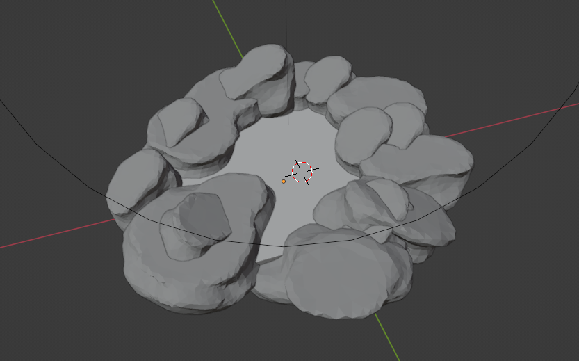
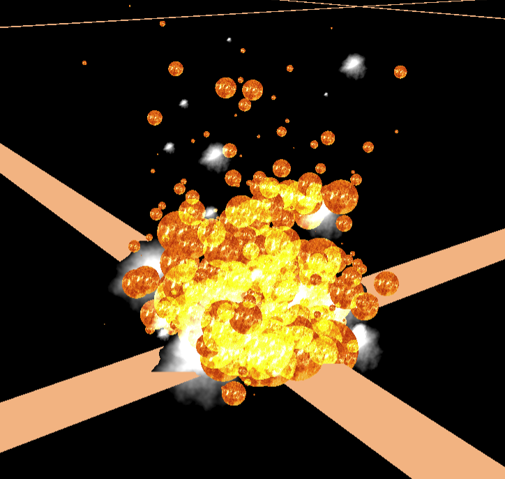
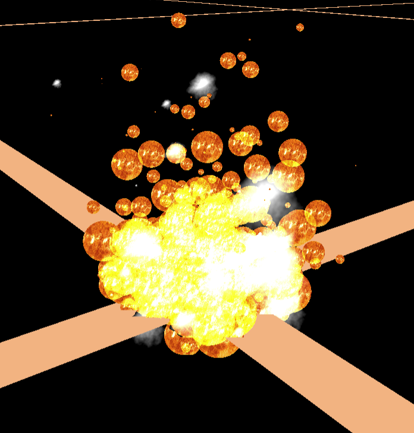
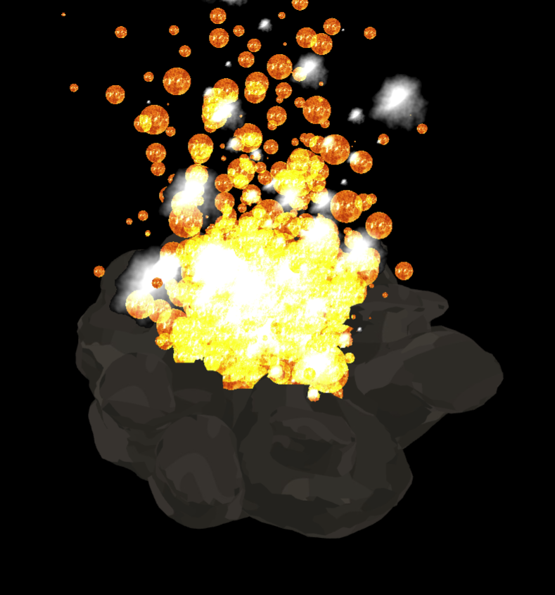
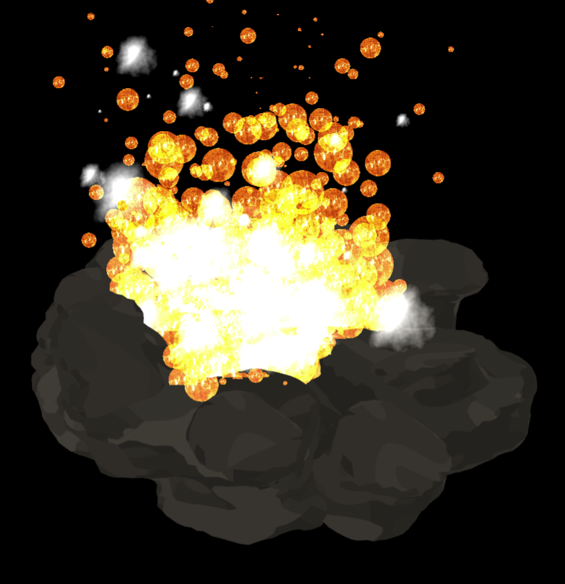
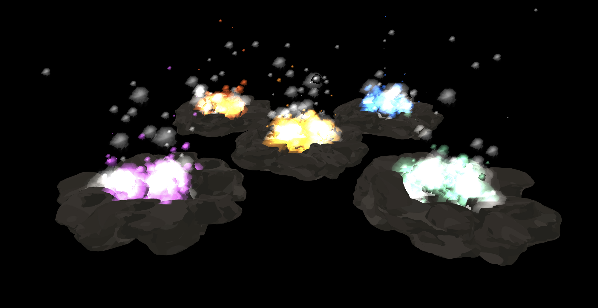

# Project Report

## Abstract
The goal of this project was to create a fire simulation. For this simulation, particles spawn according to a gaussian function, adjust their size according to Bézier Curves, and dissipate after a while. Billboards are used for the particles to increase computational efficiency and noise functions combined with pictures create the texture of the particles. Using vectors representing the color, different types of firepits are rendered, such as blue or green fires. Additionally, the camera can follow predefined paths using Bézier Curves.

## Technical Approach

#### Summary
As a starting point, the GL1 and PG1 homeworks were taken as a skeleton due to the fact that there was already a template for the camera, actors and a scene defined in GL1 and there was already existing code for noise functions in the PG1 homework.

First, in the GL1 template, the actors were modified to create fire actors with the sun texture overlayed. The particles were adapted to spawn around the origin of the scene according to a Gaussian distribution.

At the beginning, the fire particles were rendered using spheres. Over time, the particles decreased in size and moved away from the center. For each particle, a transformation matrix was allocated and the particle was added to the scene as an actor. The class FireParticlesMovement was created to compute the model_matrix and simulate the fire particles in the scene. The class SysRenderFireParticlesUnshaded is responsible for drawing the actors with 'unshaded' shader_type.

To increase the computational efficiency, billboards were used. These were constructed out of 2 triangle meshes. Then, the fire particles were displayed on them. This change was based on a billboarding homework from a previous year. To make sure the billboards are always oriented towards the camera, a matrix computation was added in FireParticlesMovement to correct the orientation of the billboards. To enable this computation, the camera position had to be added to the scene to have access to it in this class.

Additionally, to make the fire simulation more realistic, blending of the particles was implemented. This results in particles becoming brighter if there are multiple ones behind each other. To do so, blending has been added in the ParticlesRenderer class. This addition is based on the following [resource](https://github.com/regl-project/regl/blob/master/API.md#blending). 

Also, to not ensure that black parts of the particles are not drawn, an if condition has been added in the fragment shader to ensure that pixels would not be drawn if the sum of their rgb colors was less than 0.1. Additionally, to change the bilboards to a round shape, a Gaussian filter has been added to create a mask and apply it to the texture where, again, pixels could then be discarded.

Smoke particles were added in a very similar way to the fire particles. Perlin noise functions were used to create their texture. This was based on the PG1 homework. For that, in noise.frag.glsl a function that computes a cloud texture was added. This texture is stored in a buffer that is used to create the smoke particles' texture. Also for the smoke particles billboarding was used.

To make the scene more interesting, rocks were placed around the firepit. These rock meshes were downloaded from the [internet](https://www.turbosquid.com/3d-models/3d-short-flat-rocks-1909649) and adapted and combined in Blender. These rocks are rendered thanks to the class SysRenderRockUnshaded where, the rocks were loaded from the .obj files and rendered in the scene. At first, the color of the rocks was created using the moon as texture but this was changed to a darker texture found [online](https://www.shutterstock.com/image-photo/black-stone-concrete-texture-background-anthracite-1617633904) and then adapted to make the simulation more realistic.

{width="700px"}

Then, 4 new magic colored fire spots were added around the main realistic fire spot following the same procedure as the main fire pit but using different magic textures for the fire particles.

Finally, using Bézier curves, the camera's movement could, in addition to the manual movement, be moved automatically. The Bézier curve was implemented by computing the interpolation of points using the deCasteljau's algorithm in order to create a camera path following the curve automatically. The curve was also created by computing new camera angles and by giving a time of execution for the simulation of a curve.

#### Description of problems
Our first problem was that our camera eye wasn't pointing towards the origin of the scene where the fire simulation was displayed. To fix this, we created a camera_focus_translation_mat and multiplied it with mat_view and mat_turnable.

Our second problem was with the billboarding, the particles were successfully always looking at the camera but they would not have the same side looking up at all times but rotating around themselves. As discussed with the assistants, however, we left this problem out. Also, since our textures now are no longer squares, it is almost not noticible.

Our third problem was for the blending. We were not sure what parameters we should put for the dstAlpha attribute in the render as there was multiple possibilities. So we tried them all and decided that the choice 'one minus src alpha' was the one giving us the best result in our project.

Our fourth problem was the order in which the particles were drawn. By drawing particles in the back after drawing particles closer to the camera, the rendered fire had some darker elements where it should be bright (thanks to the blending). To fix this, we sorted the particles by distance to the camera before rendering them.

{height="300px"}

{height="300px"}

Our fifth problem was with the perlin noise function for the cloud texture. The texture was only on the top right corner of the image, so the smoke particles weren't looking good since there was a lot of black parts. To solve this problem, we just discarded the region of the image texture where the color was black and adapted the noise function to create the clouds in the middle of the buffer.

Our sixth problem was that we also needed to blend the rocks of the firepit with the fire to also enable smooth transitions between particles and the rocks. To do this, we drew the rocks before the particles.

{height="300px"}

{height="300px"}

# Result
In the following, the results of this project are presented. The video of the fire simulation can be found 
[here.](https://drive.google.com/file/d/1nv01i-_LBP0dGE9w3LMWFoOMRij2_zeJ/view)

{width="700px"}

# Zip of the project
The zip archive of the sources files for the project can be found the folder.

# Contribution from each team member

- Luca Engel : 0.35

- Ahmad Jarrar : 0.40

- Antoine Garin : 0.25

# Resources

Here are some links that we found to be useful for our project :

- [OpenGL tutorial for the particles](http://www.opengl-tutorial.org/intermediate-tutorials/billboards-particles/particles-instancing/)
- [Particle effects via Billboards](https://www.chinedufn.com/webgl-particle-effect-billboard-tutorial/)
- [WebGL fundamentals for writing particles in javascript](https://webglfundamentals.org/webgl/lessons/webgl-qna-efficient-particle-system-in-javascript---webgl-.html)
- [Some project report from MIT students](https://groups.csail.mit.edu/graphics/classes/6.837/F99/projects/reports/team09.pdf)
- [A fire effet simulation using GLSL](https://www.shadertoy.com/view/lsdBD2)
- [Blending Tutorial](https://learnopengl.com/Advanced-OpenGL/Blending)
- [Blending Example](https://github.com/regl-project/regl/blob/master/API.md#blending)
- [Mesh used and adapted for rocks](https://www.turbosquid.com/3d-models/3d-short-flat-rocks-1909649)
- [Texture used and adapted for the rocks](https://www.shutterstock.com/image-photo/black-stone-concrete-texture-background-anthracite-1617633904)
- [Texture used for the green_magic](https://www.shutterstock.com/image-vector/abstract-green-blue-blurred-gradient-background-561604051)