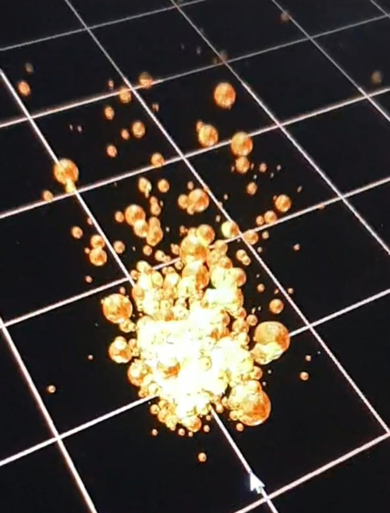
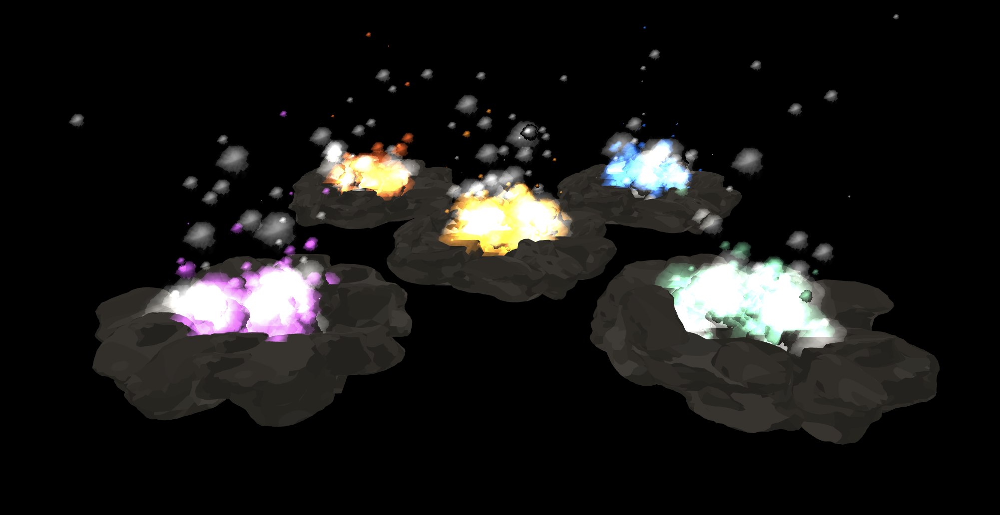

{width="700px"}

# Summary

In this project, our team will create a fire simulation based on noise functions combined with particles simulating burning ashes flying away from the fire. It will include an interactive part where the user can adapt certain parameters.

# Goals and Deliverables

For this project, our goal is to create a simulation of a fire. This will include an interactive part where the user can move the camera and adapt the fire size. This project will also entail adapting the fire temperature (which affects the fire color) depending on how far away a particular flame is from the fire center.

In the following we have listed the basic features we expect to implement for a passing grade and the advanced features we aim to achieve. We have also added some extra features at the end as potential bonus features in case we finish our project early and aim for a grade between 5.5 and 6.

#### Basic features for passing grade:

- noise function fire
- glowing ash particles flying out of the main fire part
    - have particles die after a certain time (to simulate ashes not glowing after a while)
    - Temperature influencing color of particles

#### Advanced features:
###### We would like to do the following advanced features

- noise function for smoke
- enable moving the camera
    - probably also requires billboarding

- add bloom effect to the particles

- adapt fire size
    - adapt fire temperature
    - adapt speed of particles

###### The following advanced features would be possibilities if we finish the other features early   (however, we believe this is out of the scope of this project and we will have plenty of work with the points listed above)

- add background (e.g., fire place with wood logs, etc.)
    - Shadow
- moving the fire with the curser
    - (assuming there is no wind, otherwise this would imply using a lot of physics calculations?)

# Schedule

We will all cooperate and work on the tasks together. This way we can minimize individual problems as much as possible and mitigate someone getting stuck on a bug while the others do not know much about that team member's code.

##### Week of 01.05.2023
- instanciate the project
- create fire based on noise function (basic feature)
- start with the glowing ash particles (basic feature)

##### Week of 08.05.2023
- continue with the glowing ash particles (basic feature)
- add noise function for smoke (advanced feature)

##### Week of 15.05.2023
- enable camera movement (advanced feature)
- start with bloom effect for the particles (advanced feature)

##### Week of 22.05.2023
- continue with bloom effect for the particles (advanced feature)
- enable adapting firesize (advanced feature)
- start with presentation video

##### Week of 29.05.2023
- Finalize the presentation video
- Write the report webpage

# TA Review Grading Contract
Core [4.0]
Particle rendering with billboards [only with WebGL]

- drawing billboards (a surface always facing the camera)
- simple shader of fire / smoke / cloud, based on noise (this shader is applied to the billboards)
- particles animate over time:
  - the fire evolves / smoke dissipates etc
  - particles move in space
  - particles disappear after some time smoothly
- at least 2-3 distinct types of particles (ie fire, smoke, cloud, water splash, magic)
- particles can be spawning at a constant rate

Please cite resources used (such as tutorial/articles you find online, code snippets, external libraries, 3d models) so that we can determine what is your original contribution. Thanks!

Extensions [clamped to 5.5]
[+0.25] Dealing with overlap
Particles are usually used in tight groups to create an impression of filling a volume. 
This poses a challenge since they visually overlap. One of those solutions might help:
- Use transparency and sorting
  The particle shader is partially transparent. Then it makes a difference which particle is drawn on top.
   Particles can be sorted by position to draw the ones closest to the camera last.
OR
- Use masked shader (one with `discard` instruction) to create opaque particles with holes in them (driven by the noise).
Then the depth buffer will be used to show whats in front.

[+0.5] use instanced rendering pipeline in regl, draw a big number of particles
All particles are drawn in a single draw call.
This involves setting up buffers to store the particle data and updating the buffer.

[+0.25 - +0.5] Elaborate particle spawning, [+0.25] for each spawning scheme
Particles are created at different locations in the scene for an artistic effect.
Examples:
- small asteroids split from the main one and each of them has their fire trail
- clusters of particles make clouds which move over time and animate their shape

[+1 on WebGL] Bloom multi-pass rendering pipeline.
Bloom is the glow around bright parts of the scene, it creates a very potent visual effect.
It is achieved by running a 2nd rendering pass which blurs the high-brightness areas.

[+1 on WebGL] Deferred shading multi-pass pipeline, allowing numerous small light sources.
The rendering is split into two stages: 
- save depth, normals and colors of the solid parts of the scene to a buffer
- draw the lights on top of it

[+0.5] Scene composition
The particle emitters are composed into a complete scene. 
There are multiple points where particles are spawned.

[+0.5] Camera - animated camera path and target, video cinematography
Setup several shots in your video to showcase your scene and effects. Move the camera along a programmed path.
   [+1 instead of 0.5] if camera paths are using Bézier curves for camera trajectory and you implement the formulas yourself.
  (Curve automatically generated, or manually designed for a fixed scene - if scene is gneerated you can guarantee a fixed scene by seeding the random number generator with a constant seed)

--------------------
Please let us know your thoughts!
We wish you an enjoyable and inspiring project.

If you have an implementation plan or prototype you can consult it with us before grading to determine if it satisfied the contract objective.
Reply 
See this post in context 

# Milestone Report

## Summary
We started out by having fire spawn as spherical actors that were grading with a gaussian function whose size decreased over time and disappeared over time. Also, we started with the billboarding to make the computation more efficient and not have to render entire spheres. We managed to make the billboards always look at the camera, however, when moving the camera around, the billboards do not always have the same orientation and rotate in their own plane. We have not yet been able to find out why this is the case.

This means that, from our core tasks, we have been able to complete the animation of particles and their spawning and partially complete the billboarding, the shader, and the multiple types of particles.

We started with the GL1 template since it had a lot of useful code we could have used like the camera rotation, or the use of actors in our scene for example.

## Current State
Our sphere implementation of the fire looked as follows:

{width="700px"}

This is the current state of the billboard implementation

{width="700px"}

When moving the camera around, the billboards change their orientation within their plane (which should not happen and will be fixed)

{width="700px"}

## Updated Schedule
In a next step, we will try to fix the billboard issue described above. Additionally, we will implement the bézier curve extension. We will also add the animation of smoke and its dissipation in our simulation.
Lastly, we will need to enable the fire particles to look like particles instead of squares which we are planning to do with images containing black parts which should end up being see-through

# Final Deliverables

## Abstract
This project creates a fire simulation. For this simulation, particles spawn according to a gaussian function, adjust their size according to Bézier Curves, and dissipate after a while. Billboards are used for the particles to increase computational efficiency and noise functions combined with pictures create the texture of the particles. Using vectors representing the color, different types of firepits are rendered, such as blue or green fires. Additionally, the camera can follow predefined paths using Bézier Curves.

## Technical Approach

#### Summary
As a starting point, we started with the GL1 and PG1 homeworks that we did this year due to the fact that there was already a template for the camera, actors and a scene we found would be good that were defined in GL1 and there was already nice code on noise functions in the PG1 homework, so we thought it would be a good starting point for our project.

First, we started with the GL1 template and modified the actors such that we would have fire actors with the sun texture overlayed and position the particle spawning center at the origin of the scene.

To start simple, the fire particles were rendered using spheres and the start position was calculated using a random gaussian noise function. The particles decreased in size over time and moved away from the center. This was done using an array containing all the particles which were instanciated in a for loop. For each particle, a transformation matrix was allocated and the particle was added to the scene as an actor. The class FireParticlesMovement was created to compute the model_matrix and simulate the fire particles in the scene. The class SysRenderFireParticlesUnshaded is responsible for drawing the actors with 'unshaded' shader_type.

To increase the computation efficience, billboards were used. These were constructed out of 2 triangle meshes. Then, the fire particles were projected on them. This change was based on a billboarding homework from a previous year. To make sure the billboards are always oriented towards the camera, a matrix computation was added in FireParticlesMovement to correct the orientation of the billboards. To enable this computation, the camera position had to be added to the scene to have access to it in this class.

Additionally, make the fire simulation more realistic, blending of the particles was implemented. This results in particles becoming brighter if there are multiple ones behind each other. To do so, blending has been added in the ParticlesRenderer class to apply this change. The blending is composed of an attribute alpha which determines the degree of transparency that is applied to the pixels. The blending is based on the following resource: [Blending Example](https://github.com/regl-project/regl/blob/master/API.md#blending). 

Also, to not ensure that black parts of the particles are not drawn, an if condition has been added in the fragment shader to ensure that pixels would not be drawn if the sum of their rgb colors was less than 0.1. Additionally, to change the bilboards to a round shape, a Gaussian filter has been added to create a mask and apply it to the texture where, again, pixels could then be discarded.

Smoke particles were added in a very similar way to the fire particles. Perlin noise functions were used to create their texture. This was based on the PG1 homework. For that, in noise.frag.glsl a function that computes a cloud texture was added. This texture is stored in a buffer that is used to create the smoke particles' texture. Also for the smoke particles billboarding was used.

To make the scene more interesting, rocks were placed around the firepit. These rock meshes were downloaded from the [internet](https://www.turbosquid.com/3d-models/3d-short-flat-rocks-1909649) and adapted and combined in Blender. These rocks are rendered thanks to the class SysRenderRockUnshaded where, the rocks were loaded from the .obj files and rendered in the scene. At first, the color of the rocks was created using the moon as texture but this was changed to a darker texture found [online](https://www.shutterstock.com/image-photo/black-stone-concrete-texture-background-anthracite-1617633904) and then adapted to make the simulation more realistic.

Then, 4 new magic colored fire spots were added around the main realistic fire spot following the same procedure as the main fire pit but using different magic textures for the fire particles.

Finally, using Bézier curves, the camera's movement could, in addition to the manual movement, be moved automatically. The Bézier curve was implemented by computing the interpolation of points using the deCasteljau's algorithm in order to create a camera path following the curve automatically. The curve was also created by computing new camera angles and by giving a time of execution for the simulation of a curve.

#### Description of problems
Our first problem was that our camera eye wasn't pointing towards the origin of the scene where the fire simulation was displayed. To fix this, we created a camera_focus_translation_mat and multiplied it with mat_view and mat_turnable.

Our second problem was with the billboarding, the particles were successfully always looking at the camera but they would not have the same side looking up at all times but rotating around themselves. As discussed with the assistants, however, we left this problem out. Also, since our textures now are no longer squares, it is almost not noticible.

Our third problem was for the blending. We were not sure what parameters we should put for the dstAlpha attribute in the render as there was multiple possibilities. So we tried them all and decided that the choice 'one minus src alpha' was the one giving us the best result in our project.

Our fourth problem was with the perlin noise function for the cloud texture. The texture was only on the top right corner of the image, so the smoke particles weren't looking good since there was a lot of black parts. To solve this problem, we just discarded the region of the image texture where the color was black and adapted the noise function to create the clouds in the middle of the buffer.

# Result

{width="700px"}

# Zip of the project
The zip archive of the sources files for the project is in the folder, feel free to check it out !

# Contribution from each team member

- Luca Engel : 0.35

- Ahmad Jarrar : 0.40

- Antoine Garin : 0.25

# Resources

Here are some links that we found to be useful for our project :

- [OpenGL tutorial for the particles](http://www.opengl-tutorial.org/intermediate-tutorials/billboards-particles/particles-instancing/)
- [Particle effects via Billboards](https://www.chinedufn.com/webgl-particle-effect-billboard-tutorial/)
- [WebGL fundamentals for writing particles in javascript](https://webglfundamentals.org/webgl/lessons/webgl-qna-efficient-particle-system-in-javascript---webgl-.html)
- [Some project report from MIT students](https://groups.csail.mit.edu/graphics/classes/6.837/F99/projects/reports/team09.pdf)
- [A fire effet simulation using GLSL](https://www.shadertoy.com/view/lsdBD2)
- [Blending Tutorial](https://learnopengl.com/Advanced-OpenGL/Blending)
- [Blending Example](https://github.com/regl-project/regl/blob/master/API.md#blending)
- [Mesh used and adapted for rocks](https://www.turbosquid.com/3d-models/3d-short-flat-rocks-1909649)
- [Texture used and adapted for the rocks](https://www.shutterstock.com/image-photo/black-stone-concrete-texture-background-anthracite-1617633904)
- [Texture used for the green_magic](https://www.shutterstock.com/image-vector/abstract-green-blue-blurred-gradient-background-561604051)

# File containing all our original code