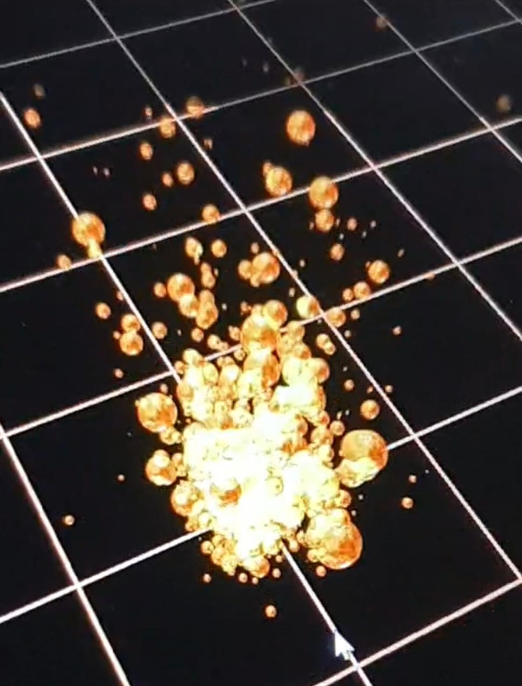
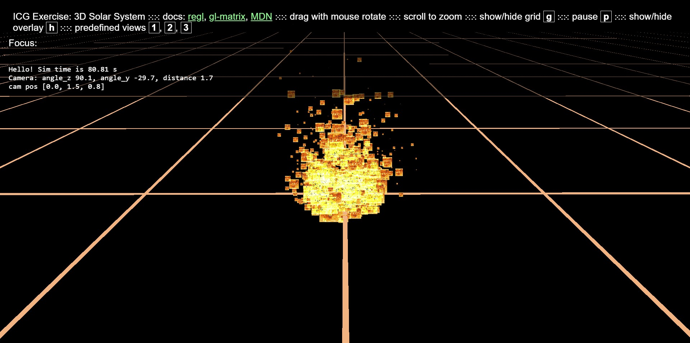
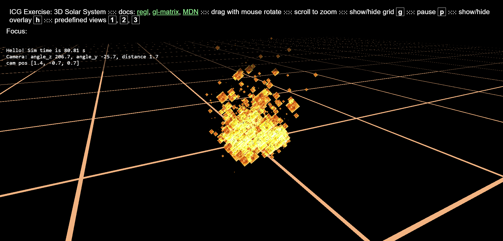

{width="700px"}

# Summary

In this project, our team will create a fire simulation based on noise functions combined with particles simulating burning ashes flying away from the fire. It will include an interactive part where the user can adapt certain parameters.

# Goals and Deliverables

For this project, our goal is to create a simulation of a fire. This will include an interactive part where the user can move the camera and adapt the fire size. This project will also entail adapting the fire temperature (which affects the fire color) depending on how far away a particular flame is from the fire center.

In the following we have listed the basic features we expect to implement for a passing grade and the advanced features we aim to achieve. We have also added some extra features at the end as potential bonus features in case we finish our project early and aim for a grade between 5.5 and 6.

#### Basic features for passing grade:

- noise function fire
- glowing ash particles flying out of the main fire part
    - have particles die after a certain time (to simulate ashes not glowing after a while)
    - Temperature influencing color of particles

#### Advanced features:
###### We would like to do the following advanced features

- noise function for smoke
- enable moving the camera
    - probably also requires billboarding

- add bloom effect to the particles

- adapt fire size
    - adapt fire temperature
    - adapt speed of particles

###### The following advanced features would be possibilities if we finish the other features early   (however, we believe this is out of the scope of this project and we will have plenty of work with the points listed above)

- add background (e.g., fire place with wood logs, etc.)
    - Shadow
- moving the fire with the curser
    - (assuming there is no wind, otherwise this would imply using a lot of physics calculations?)

# Schedule

We will all cooperate and work on the tasks together. This way we can minimize individual problems as much as possible and mitigate someone getting stuck on a bug while the others do not know much about that team member's code.

##### Week of 01.05.2023
- instanciate the project
- create fire based on noise function (basic feature)
- start with the glowing ash particles (basic feature)

##### Week of 08.05.2023
- continue with the glowing ash particles (basic feature)
- add noise function for smoke (advanced feature)

##### Week of 15.05.2023
- enable camera movement (advanced feature)
- start with bloom effect for the particles (advanced feature)

##### Week of 22.05.2023
- continue with bloom effect for the particles (advanced feature)
- enable adapting firesize (advanced feature)
- start with presentation video

##### Week of 29.05.2023
- Finalize the presentation video
- Write the report webpage

# TA Review Grading Contract
Core [4.0]
Particle rendering with billboards [only with WebGL]

- drawing billboards (a surface always facing the camera)
- simple shader of fire / smoke / cloud, based on noise (this shader is applied to the billboards)
- particles animate over time:
  - the fire evolves / smoke dissipates etc
  - particles move in space
  - particles disappear after some time smoothly
- at least 2-3 distinct types of particles (ie fire, smoke, cloud, water splash, magic)
- particles can be spawning at a constant rate

Please cite resources used (such as tutorial/articles you find online, code snippets, external libraries, 3d models) so that we can determine what is your original contribution. Thanks!

Extensions [clamped to 5.5]
[+0.25] Dealing with overlap
Particles are usually used in tight groups to create an impression of filling a volume. 
This poses a challenge since they visually overlap. One of those solutions might help:
- Use transparency and sorting
  The particle shader is partially transparent. Then it makes a difference which particle is drawn on top.
   Particles can be sorted by position to draw the ones closest to the camera last.
OR
- Use masked shader (one with `discard` instruction) to create opaque particles with holes in them (driven by the noise).
Then the depth buffer will be used to show whats in front.

[+0.5] use instanced rendering pipeline in regl, draw a big number of particles
All particles are drawn in a single draw call.
This involves setting up buffers to store the particle data and updating the buffer.

[+0.25 - +0.5] Elaborate particle spawning, [+0.25] for each spawning scheme
Particles are created at different locations in the scene for an artistic effect.
Examples:
- small asteroids split from the main one and each of them has their fire trail
- clusters of particles make clouds which move over time and animate their shape

[+1 on WebGL] Bloom multi-pass rendering pipeline.
Bloom is the glow around bright parts of the scene, it creates a very potent visual effect.
It is achieved by running a 2nd rendering pass which blurs the high-brightness areas.

[+1 on WebGL] Deferred shading multi-pass pipeline, allowing numerous small light sources.
The rendering is split into two stages: 
- save depth, normals and colors of the solid parts of the scene to a buffer
- draw the lights on top of it

[+0.5] Scene composition
The particle emitters are composed into a complete scene. 
There are multiple points where particles are spawned.

[+0.5] Camera - animated camera path and target, video cinematography
Setup several shots in your video to showcase your scene and effects. Move the camera along a programmed path.
   [+1 instead of 0.5] if camera paths are using Bézier curves for camera trajectory and you implement the formulas yourself.
  (Curve automatically generated, or manually designed for a fixed scene - if scene is gneerated you can guarantee a fixed scene by seeding the random number generator with a constant seed)

--------------------
Please let us know your thoughts!
We wish you an enjoyable and inspiring project.

If you have an implementation plan or prototype you can consult it with us before grading to determine if it satisfied the contract objective.
Reply 
See this post in context 

# Milestone Report

## Summary
We started out by having fire spawn as spherical actors that were grading with a gaussian function whose size decreased over time and disappeared over time. Also, we started with the billboarding to make the computation more efficient and not have to render entire spheres. We managed to make the billboards always look at the camera, however, when moving the camera around, the billboards do not always have the same orientation and rotate in their own plane. We have not yet been able to find out why this is the case.

This means that, from our core tasks, we have been able to complete the animation of particles and their spawning and partially complete the billboarding, the shader, and the multiple types of particles.

We started with the GL1 template since it had a lot of useful code we could have used like the camera rotation, or the use of actors in our scene for example.

## Current State
Our sphere implementation of the fire looked as follows:

{width="700px"}

This is the current state of the billboard implementation

{width="700px"}

When moving the camera around, the billboards change their orientation within their plane (which should not happen and will be fixed)

{width="700px"}

## Updated Schedule
In a next step, we will try to fix the billboard issue described above. Additionally, we will implement the bézier curve extension. We will also add the animation of smoke and its dissipation in our simulation.
Lastly, we will need to enable the fire particles to look like particles instead of squares which we are planning to do with images containing black parts which should end up being see-through

# Resources

Here are some links that we found could be useful for our project :

- [OpenGL tutorial for the particles](http://www.opengl-tutorial.org/intermediate-tutorials/billboards-particles/particles-instancing/)
- [WebGL fundamentals for writing particles in javascript](https://webglfundamentals.org/webgl/lessons/webgl-qna-efficient-particle-system-in-javascript---webgl-.html)
- [Some project report from MIT students](https://groups.csail.mit.edu/graphics/classes/6.837/F99/projects/reports/team09.pdf)
- [A fire effet simulation using GLSL](https://www.shadertoy.com/view/lsdBD2)